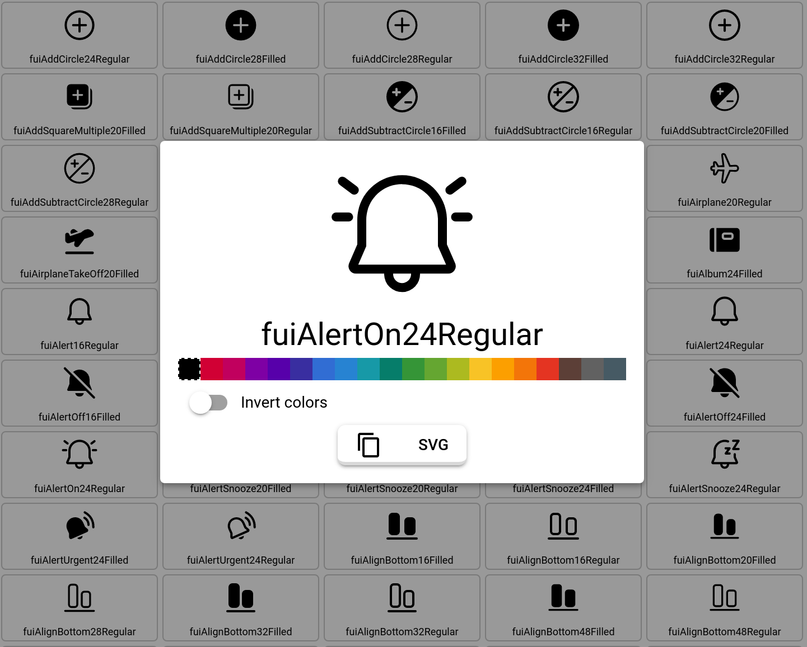

# iconexplorer.app

## Searchable Quasar Framework SVG icons

The [iconexplorer.app](https://iconexplorer.app/) uses SVG icons from [@quasar/extras](https://github.com/quasarframework/quasar/tree/dev/extras) and [quasar-extras-svg-icons](https://github.com/hawkeye64/quasar-extras-svg-icons). It allows you to search and find that perfect SVG you've been hunting for so you can add it to your Quasar app.

The original SVG files have been converted to Quasar's short-hand (flattened) format and won't work with other libraries except for Quasar Framework (QIcon and QBtn).

## Using the Icon Explorer app

From the left drawer, select an icon set. All of the icons from that icon set will appear. You can use the filter bar to search the names of the icons.

Once you find an icon you want click on it. A bottom sheet is displayed with a larger version of the icon. You can play with changing the color or inverting the foreground and background colors. There are several buttons available that will copy the icon in different formats to the clipboard.

If you are looking for multiple icons, then use the `Add to library` button. You will notice the cart icon in the upper-right changes to show there are items in your library. Select several icons in this manner, even from different icon sets. Then, click the cart icon. A right-side drawer is revealed with your selected icons. Click the `Imported` button to have the icons copied to your clipboard. The format is code, so all you have to do is paste it directly into your code.

Here is an example of icons that were selected from multiple icon sets:

```js
import { matAddAPhoto, matAddAlert, matAddShoppingCart } from '@quasar/extras/material-icons'
import { antOutlinedAudioMuted, antOutlinedAudio } from 'quasar-extras-svg-icons/ant-design-icons'
```

If you select an icon set that doesn't come from `@quasar/extras` make sure to install the `quasar-extras-svg-icons` as explained on this [page](https://github.com/hawkeye64/quasar-extras-svg-icons).

## Advanced Filtering

The filter bar accepts regular expressions. For instance, in the simplist form, you can search for a single word, such as **map**. But, you can do a multiple word search by adding a **|** between words. Now, we can seach for **map|pin** at the same time. However, you may get false-positives with words like "shop**pin**g" or "s**pin**ner". With regular expressions, you can filter these out. We can create a search like this **(?!pint|ping|maple)(pin|map)**. The first part is using a regular expression look-ahead to filter out what we don't want, before looking for what we do want. Words containing **pint**, **ping** or **maple** are skipped before looking for **pin** and **map**.

### SVG name format
Svg icons will be defined as String with the following syntax:

```
Syntax: "<path>|<viewBox>" or "<path>" (with implicit viewBox of '0 0 24 24')
Examples:
  M9 3L5 6.99h3V14h2V6.99h3L9 3zm7 14.01V10h-2v7.01h-3L15 21l4-3.99h-3z|0 0 24 24
  M9 3L5 6.99h3V14h2V6.99h3L9 3zm7 14.01V10h-2v7.01h-3L15 21l4-3.99h-3z
```

A more complex example with attributes, would look like this:
```
M3 12H6L9 3L15 21L18 12H21@@stroke-width:1.5;fill:none;stroke:currentColor;stroke-linecap:round;stroke-linejoin:round;
```

## Donate
If you appreciate the work that went into this project, please consider donating to [Quasar](https://donate.quasar.dev) or [Jeff](https://github.com/sponsors/hawkeye64).
## Stay in Touch

For latest releases and announcements, follow on Twitter: [@jgalbraith64](https://twitter.com/jgalbraith64)

## Chat Support

Ask questions at the official community Discord server: [https://chat.quasar.dev](https://chat.quasar.dev)

## License

All assets included in this repository are exclusive property of their respective owners and licensed under their own respective licenses. Quasar and Jeff do not take any credit for SVG packages included here.
