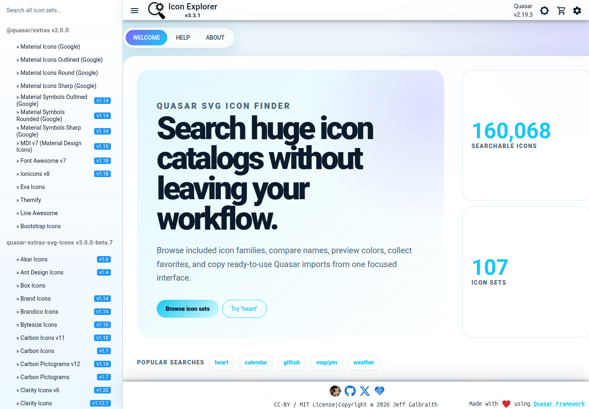

# iconexplorer.app

[](https://app.netlify.com/projects/iconexplorer-app/deploys)



## Searchable SVG icons for Quasar apps

[iconexplorer.app](https://iconexplorer.app/) helps you browse large Quasar-ready icon catalogs without memorizing package names or import paths. It includes SVG icons from [@quasar/extras](https://github.com/quasarframework/quasar/tree/dev/extras) and [quasar-extras-svg-icons](https://github.com/hawkeye64/quasar-extras-svg-icons), then gives you search, preview, color checks, and copy workflows in one focused app.

The source SVG files are converted to Quasar's short-hand flattened format so they can be used directly with `QIcon`, `QBtn`, and application code that imports SVG constants.

## Using the Icon Explorer app

Use the left drawer to choose an icon set, then search within that set or across the catalog. The search bar supports plain text and regular expressions, so you can move quickly from broad words like `calendar` or `github` to tighter filters when a package has thousands of matches.

Once you find an icon, open its preview to inspect it at a larger size, test colors, and copy it in the format you need. The app is designed for real project work: quick one-off copies when you already know what you want, and a library/cart workflow when you are gathering several icons for a feature.

If you are looking for multiple icons, use `Add to library`. You can collect icons from different packages, open the library drawer, and copy grouped package-aware import statements that are ready to paste into your code.

Here is an example of icons that were selected from multiple icon sets:

```js
import { matAddAPhoto, matAddAlert, matAddShoppingCart } from '@quasar/extras/material-icons'
import { antOutlinedAudioMuted, antOutlinedAudio } from 'quasar-extras-svg-icons/ant-design-icons'
```

If you select an icon set that does not come from `@quasar/extras`, make sure to install `quasar-extras-svg-icons` as explained on this [page](https://github.com/hawkeye64/quasar-extras-svg-icons).

## Advanced Filtering

The filter bar accepts regular expressions. In the simplest form, you can search for a single word, such as **map**. You can also search for multiple words by adding a **|** between them, such as **map|pin**. However, that can produce false positives with words like "shop**pin**g" or "s**pin**ner". With regular expressions, you can filter these out. For example, **(?!pint|ping|maple)(pin|map)** uses a look-ahead to skip words containing **pint**, **ping**, or **maple** before looking for **pin** and **map**.

### SVG name format

SVG icons are defined as strings with the following syntax:

```
Syntax: "<path>|<viewBox>" or "<path>" (with implicit viewBox of '0 0 24 24')
Examples:
  M9 3L5 6.99h3V14h2V6.99h3L9 3zm7 14.01V10h-2v7.01h-3L15 21l4-3.99h-3z|0 0 24 24
  M9 3L5 6.99h3V14h2V6.99h3L9 3zm7 14.01V10h-2v7.01h-3L15 21l4-3.99h-3z
```

A more complex example with attributes, would look like this:

```
M3 12H6L9 3L15 21L18 12H21@@stroke-width:1.5;fill:none;stroke:currentColor;stroke-linecap:round;stroke-linejoin:round;
```

## Support

If iconexplorer.app is useful in your workflow and you want to support ongoing maintenance:

- GitHub Sponsors: https://github.com/sponsors/hawkeye64
- PayPal: https://paypal.me/hawkeye64

## License

All assets included in this repository are exclusive property of their respective owners and licensed under their own respective licenses. Quasar and Jeff do not take any credit for SVG packages included here.
