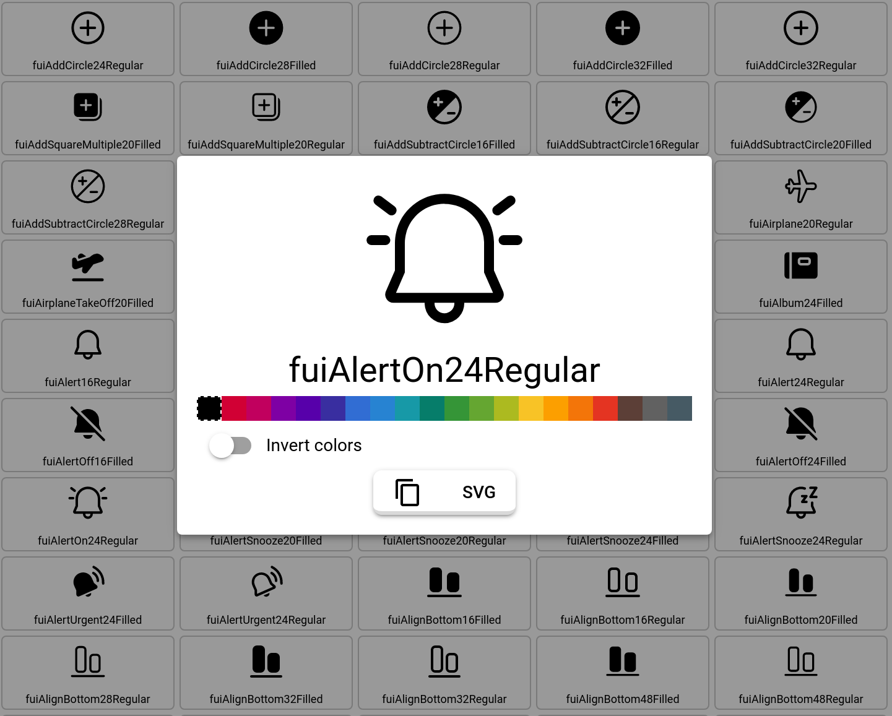

# iconexplorer.app

[](https://app.netlify.com/projects/iconexplorer-app/deploys)

## Searchable Quasar Framework SVG icons

The [iconexplorer.app](https://iconexplorer.app/) uses SVG icons from [@quasar/extras](https://github.com/quasarframework/quasar/tree/dev/extras) and [quasar-extras-svg-icons](https://github.com/hawkeye64/quasar-extras-svg-icons). It helps you find the right SVG icon quickly so you can add it to your Quasar app.

The original SVG files have been converted to Quasar's short-hand (flattened) format and are intended for Quasar's `QIcon` and `QBtn` components.

## Using the Icon Explorer app

From the left drawer, select an icon set. All of the icons from that icon set will appear. You can use the filter bar to search the names of the icons.

Once you find an icon you want, click it. A bottom sheet is displayed with a larger version of the icon. You can change the color, invert the foreground and background colors, and copy the icon in several useful formats.

If you are looking for multiple icons, use the `Add to library` button. The cart icon in the upper-right changes to show there are items in your library. Select several icons this way, even from different icon sets. Then click the cart icon to open the right-side drawer with your selected icons. Click the `Imports` button to copy grouped import statements to your clipboard, ready to paste into your code.

Here is an example of icons that were selected from multiple icon sets:

```js
import { matAddAPhoto, matAddAlert, matAddShoppingCart } from '@quasar/extras/material-icons'
import { antOutlinedAudioMuted, antOutlinedAudio } from 'quasar-extras-svg-icons/ant-design-icons'
```

If you select an icon set that does not come from `@quasar/extras`, make sure to install `quasar-extras-svg-icons` as explained on this [page](https://github.com/hawkeye64/quasar-extras-svg-icons).

## Advanced Filtering

The filter bar accepts regular expressions. In the simplest form, you can search for a single word, such as **map**. You can also search for multiple words by adding a **|** between them, such as **map|pin**. However, that can produce false positives with words like "shop**pin**g" or "s**pin**ner". With regular expressions, you can filter these out. For example, **(?!pint|ping|maple)(pin|map)** uses a look-ahead to skip words containing **pint**, **ping**, or **maple** before looking for **pin** and **map**.

### SVG name format

SVG icons are defined as strings with the following syntax:

```
Syntax: "<path>|<viewBox>" or "<path>" (with implicit viewBox of '0 0 24 24')
Examples:
  M9 3L5 6.99h3V14h2V6.99h3L9 3zm7 14.01V10h-2v7.01h-3L15 21l4-3.99h-3z|0 0 24 24
  M9 3L5 6.99h3V14h2V6.99h3L9 3zm7 14.01V10h-2v7.01h-3L15 21l4-3.99h-3z
```

A more complex example with attributes, would look like this:

```
M3 12H6L9 3L15 21L18 12H21@@stroke-width:1.5;fill:none;stroke:currentColor;stroke-linecap:round;stroke-linejoin:round;
```

## Support

If iconexplorer.app is useful in your workflow and you want to support ongoing maintenance:

GitHub Sponsors: https://github.com/sponsors/hawkeye64
PayPal: https://paypal.me/hawkeye64

## License

All assets included in this repository are exclusive property of their respective owners and licensed under their own respective licenses. Quasar and Jeff do not take any credit for SVG packages included here.
